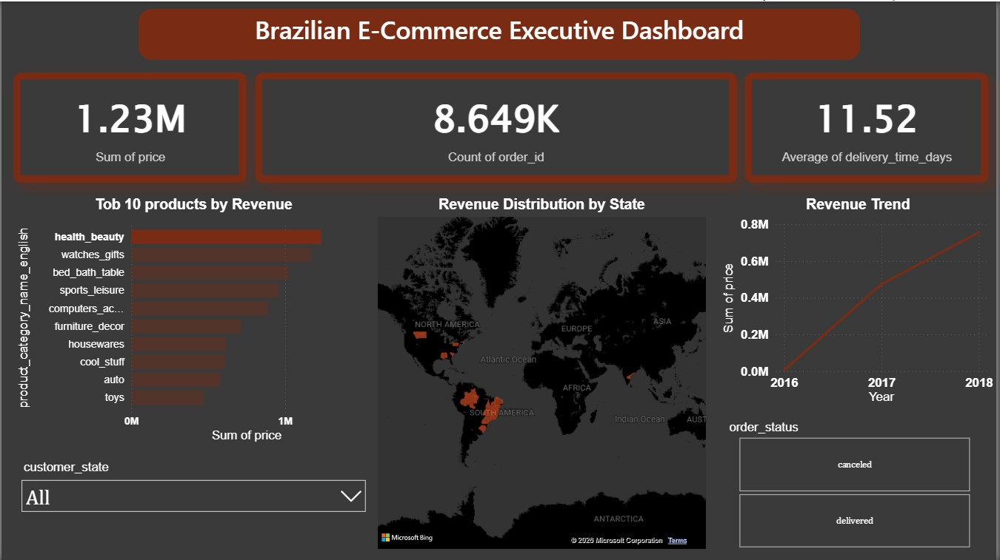

# Brazilian E-Commerce Analytics & Executive Dashboard 📊

An end-to-end data analytics project focused on cleaning, merging, and analyzing a complex relational e-commerce dataset (Olist) containing over 112,000 rows. The project culminates in a high-fidelity, interactive Power BI executive dashboard designed for strategic decision-making.

##  Executive Dashboard Preview

##  Tech Stack & Skills Highlighted
* **Data Engineering & Cleaning:** Python (Pandas, NumPy) via VS Code.
* **Statistical Analysis:** Python (SciPy) for correlation and distribution analysis.
* **Business Intelligence & Visualization:** Microsoft Power BI.
* **Core Competencies:** ETL Process, Relational Data Merging, Outlier Detection, UI/UX Dashboard Design (Dark Theme), KPI Development.

##  Project Workflow

### 1. Data Cleaning & Integration (Python)
* Integrated and merged multiple relational tables (customers, orders, items, payments, products) into a unified dataset using Pandas.
* Handled missing values, standardized data types, and filtered product categories utilizing English translation mappings.
* Conducted statistical outlier analysis on product prices and freight values to ensure baseline data integrity.

###  2. Statistical Insights & EDA
* **Correlation Analysis:** Investigated the relationship between product pricing and delivery logistics to identify patterns affecting profit margins.
* **Hypothesis Testing:** Evaluated delivery time variance across geographical regions to discover logistical bottlenecks.
* **Descriptive Metrics:** Calculated overall delivery averages and distinct order volumes to track structural distribution.

###  3. Interactive Power BI Dashboard Design
* **Advanced UI/UX:** Built on a customized premium Dark Theme for maximized cognitive readability and professional aesthetics.
* **Geographical Mapping:** Implemented a spatial Filled Map visualization showcasing real-time revenue density across Brazilian states.
* **Executive KPIs:** Configured explicit card measures for Total Revenue, Total Orders, and Average Delivery Duration.
* **Dynamic Filtering:** Integrated cross-filtering slicers allowing instant switching between order statuses (delivered/canceled) and regional dropdowns.

## How to View this Project
1. **Python Script:** Open the `ecommerce_analysis.ipynb` file to review the full ETL process and exploratory data analysis.
2. **Power BI Dashboard:** Download the `Olist_Sales_Dashboard.pbix` file and open it in *Power BI Desktop* to interact with the live visualizations and filters.
